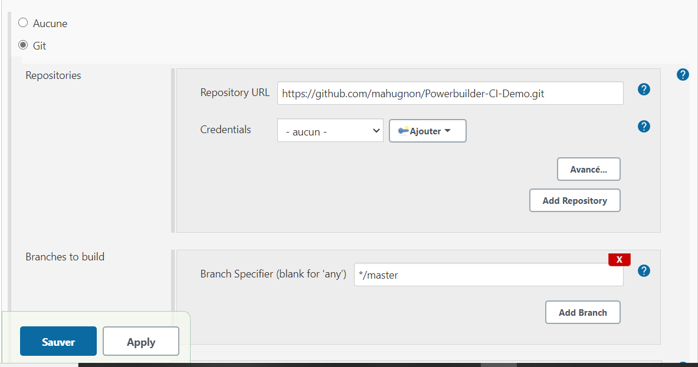
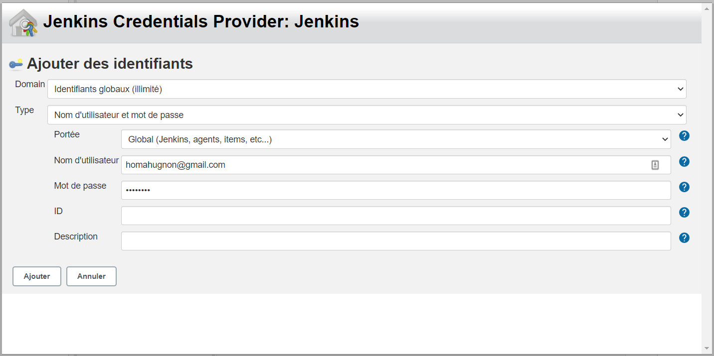
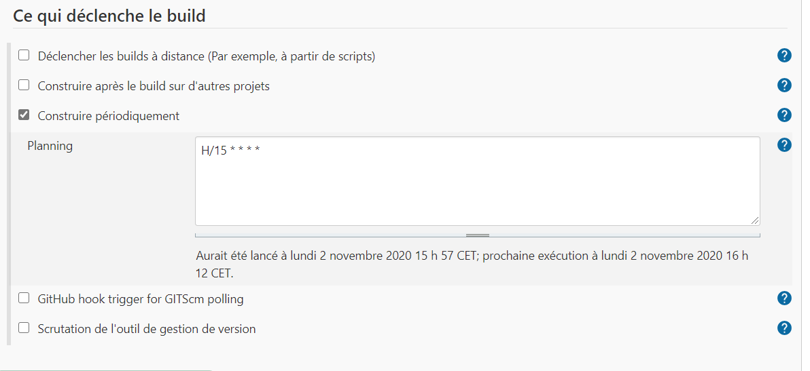
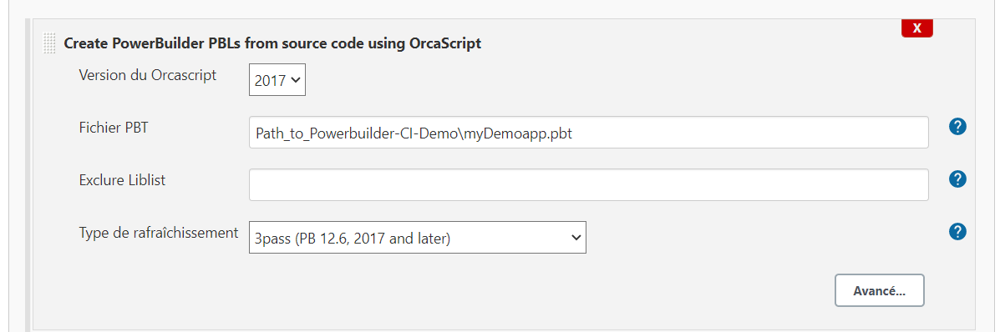
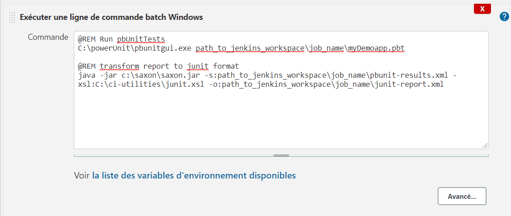
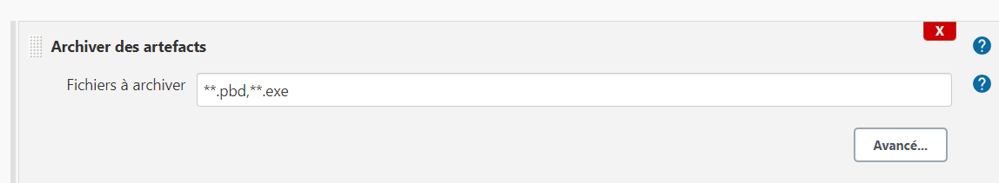
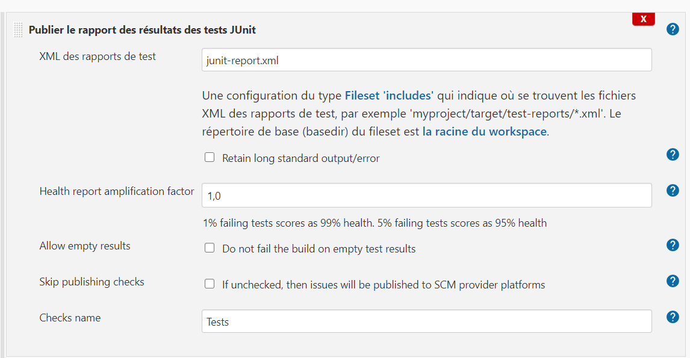

#   Continuous integration with Powerbuilder  

To fully configure a continuous integration tool for Powerbuilder with basic function like: code update on commit which include pbls generation, unit tests running and report and executable generation, you need to follow serveral steps. Here I will indicate each steps and discuss possible problem or wolkaround needed to make it work. The use case will be a simple Powerbuilder project with Jinkins CI tool.  

##  Requirement

To follow along this documentation,  you need to have the following setup in your machine :

-  Have basic knowledge of version controle system. Here **Git** is the use case.
-  Have java installed in your machine. I have Jdk 1.8
-  The powerbuilder IDE: I'm using the Powerbuilder 2017 version
-  Jenkins CI tool
-  Jenkins PBC pluggin file from [ github](https://github.com/bruce-armstrong/pbc_compile-plugin-2019.git) and unzip it
-  Jenkins Orcascript pluggin form [ github](https://github.com/bruce-armstrong/orcascript-plugin-2019.git) and unzip it
-  PBUnit: there are two repositories on github. I suggest  that download the one  [ here on github](https://github.com/mahugnon/PowerUnitHonore.git) which is  a reorganised version of [marivard/powerunit](https://github.com/marivard/powerunit.git)
-   Download  and install `xsl` transformation tool  following [ this link](https://dev.pageseeder.com/get_started/tutorials/how_to_run_xslt_from_the_command_line.html)
-  Download the example project we will be using  form [ github](https://github.com/mahugnon/Powerbuilder-CI-Demo.git)

With these , we're ready to go  .

##  Configure PBUnit

-  Create a new folder in `C:\pbUnit`
-  Copy the content of `PowerUnitHonore/package/` folder into the `C:\pbUnit`

##  Prepare the example project

-  Remove the `.git` folder from the project
-  Create your own github repository
-  Initialize git in for the project  and push it in your own repository
-  For technical reason that I expained  [ here](https://github.com/mahugnon/PowerbuilderWiki/blob/master/PBLRegeneration.md) for interrested reader, copy the contents of the directory `Powerbuilder-CI-Demo/resources/*.pbg`  into `Powerbuilder-CI-Demo`


##  Intallation of Jinkins pluggins

Once you install Jinkins, run it

-  Go to <kbd>Configure Jenkins</kbd> > <kbd>Plugins management</kbd>  >  <kbd>Advance</kbd>.

-  In the section <kbd> Submit a plugin </kbd> clic on  <kbd>choose a file</kbd> and select  `orcascript-2019.hpi`, submit and restart Jenkins  
-  Do the same step as previous and select `pbc-compile-2019.hpi`, submit and restart Jenkins

##  Configure new Powerbuilder project job on Jenkins
  
-  Click on <kbd>New Job</kbd>
-   name it  `Powerbuilder-CI-Demo` and select `free-style project`
-   In the Source code management section, select `Github`  paste your project git url 


  

-  Select  <kbd>Add key</kbd> button to add your github credentials as follow: 
  



  
-   Save and <kbd>Tigger build<kbd>
  
-  Come back to configuration

-  Sroll to the section  <kbd>Tigger build</kbd> and check <kbd>Build periodically</kbd>.  
-  Write `H/15 * * * *`  in the textarea.  Like that build
-  will be automatically triggered each `15 minute` 
  
  
 


-  Next, click <kbd>Add build action</kbd>. Choose <kbd>Create Powerbuilder PBLs from source code using OrcaScript</kbd>

-  Fill the PBT file text field with 
  
  
  `path_to_jenkins_workspace/job_name/pbt_name.pbt`



-  Click  <kbd> Add build action</kbd> > <kbd>Execute Windows batch command</kbd>. Here we will add batch script to run `PBUnit` tests and reports tests results in `JUnit` format. The batch script should be like:
  
```batch

  @REM Run PBUnit tests
  C:\powerUnit\pbunitgui.exe path_to_jenkins_workspace\job_name\Taget_name.pbt
  
  @REM Transform PBUnit report to JUnit report format
    java -jar c:\saxon\saxon.jar -s:path_to_jenkins_workspace\job_name\pbunit-results.xml -xsl:C:\ci-utilities\junit.xsl -o:path_to_jenkins_workspace\job_name\junit-report.xml
```




-  Click <kbd>Add build action</kbd> > <kbd>Create a Powerbuilder target using PBC</kbd>

-  Paste the following code in the textarea by replacing     path accordingly
  
    ```batch
        /d " path_to_jenkins_workspace\job_name\Taget_name.pbt" /o "path_to_jenkins_workspace\job_name\executable_name.exe" /w n /i /m n /x 32 /bg y /p "PowerBuilder Enterprise Series" /cp "CIM" /de "Appeon Product File" /v "1.0.0.1" /vn "1.0.0.1" /fv "1.0.0.1" /fvn "1.0.0.1" /ge 0 
    ```
  

-  Click <kbd> Choose action after build</kbd> > <kbd> Archieve artefacts</kbd> 
-  Fill the text field with `**.pbd,**.exe`
  
  


-  Click <kbd> Choose action after build</kbd> > <kbd> Pubish JUnit tests results</kbd>
-  Fill the text field with `junit-report.xml`
  
  

-  Save and trigger a new build

##  Thank for reading 
